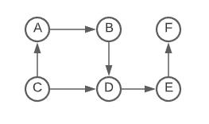

# Read the solution [Here](https://quastor.org/cracking-the-coding-interview/trees-and-graph/route-between-nodes)

# Route Between Nodes

## Cracking The Coding Interview 4.1

<br/>

# Question

Given a directed graph, design an algorithm to find out whether there is a route between two nodes

Example graph


```

Input -  start = A, end = F
output - True

Input - start = A, end = C
output - False

```

<details>
  <summary>BFS Solution</summary>

Start a breadth-fist-search from the start node check if the end node is found, keep track of visited nodes to avoide cycles and repetion of nodes.
    
```python
from queue import Queue
from collections import defaultdict
from typing import DefaultDict, List

def search(graph: DefaultDict ,start : str,end : str) -> bool:
    visited_nodes = set()
    q = Queue()
    q.put(start)
    while not q.empty():
        curr_node = q.get()
        if curr_node == end:
            return True
        else:
            visited_nodes.add(curr_node)
        for adj_node in graph[curr_node]:
            if adj_node not in visited_nodes:
                q.put(adj_node)

    return False

```
Time complexity O(n), we visit all the nodes once in worst case.
Space complexity O(n), a node might be connected to all the nodes, in that case queue will have all nodes.
</details>
<details>
  <summary>DFS Solution</summary>

Start a depth-first-search from the start check if the end node is found, keep track of visited nodes to avoid cycles and repetition of nodes.

```python
from queue import Queue
from collections import defaultdict
from typing import DefaultDict, List

def search(graph : DefaultDict, start : str, end: str) ->bool:
    def dfs_search(graph,curr_node,end,visited):
        if curr_node == end:
            return True
        else:
            for adj_node in graph[curr_node]:
                if adj_node not in visited:
                    visited.add(curr_node)
                    return True if  dfs_search(graph,adj_node, end,visited) else False
    return dfs_search(graph, start, end, set(start))

```
Time complexity O(n), we visit all the nodes once in worst case.
Space complexity O(n), because of the recursion stack.
</details>  